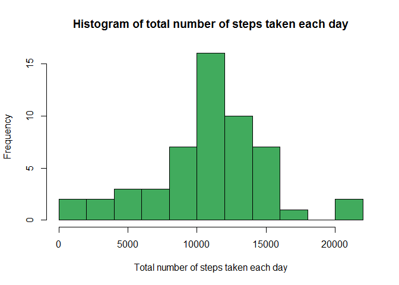
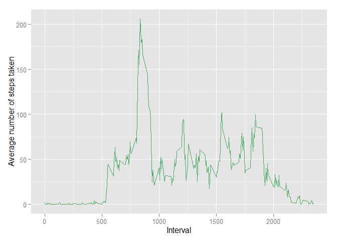
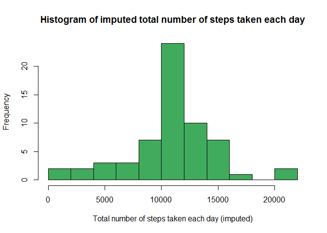
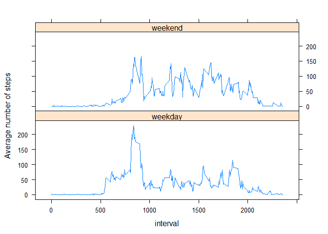

# Reproducible Research: Peer Assessment 1


## Loading and preprocessing the data


```r
library(dplyr)
```

```
## 
## Attaching package: 'dplyr'
## 
## The following object is masked from 'package:stats':
## 
##     filter
## 
## The following objects are masked from 'package:base':
## 
##     intersect, setdiff, setequal, union
```

```r
library(ggplot2)

setwd("C:/Coursera/Reproducible Research/Project 1")
myData <- read.csv("activity.csv", header=T, stringsAsFactors=FALSE)
```

## What is mean total number of steps taken per day?


```r
#
#	mean total number of steps taken per day
#	1. sum steps for each day, and make a histogram
#	
dateTotal <- myData %>%
    filter(!is.na(steps)) %>%
    group_by(date) %>%
    summarise(totalSteps=sum(steps))

fillColour <-  "#41AB5D"
hist(dateTotal$totalSteps,
     main="Histogram of total number of steps taken each day",
     xlab="Total number of steps taken each day",
     breaks=10,
     col = fillColour
     )
```

 

```r
#
#	2. Calculate and report the mean and median number of steps taken per day 
#
dateSummary <- summary(dateTotal$totalSteps)
```
   
. The mean total number of steps taken per day is: 1.077\times 10^{4}.   
. The median total number of steps taken per day is: 1.076\times 10^{4}.   


## What is the average daily activity pattern?

The time series plot of the average daily activity pattern is shown below:

```r
#
#	Average Daily Activity Pattern
#
dateInterval <- myData %>%
    filter(!is.na(steps)) %>%
    group_by(interval) %>%
    summarise(mean=mean(steps))

ggplot(data=dateInterval, aes(x=interval, y=mean)) +
    geom_line(col = fillColour) +
    labs(x = "Interval",
         y = "Average number of steps taken"
         )
```

 

```r
# find out the interval contains the maximum number of steps
maxIntervale <- dateInterval[which(dateInterval[, 2] == max(dateInterval[, 2])), 1]
```
The 835 interval contains the maximum number of steps on average across all the days in the dataset.   

## Imputing missing values


```r
#	number of missing value rows -- 2304
NACount <- sum(is.na(myData[, 1]))
```

the total number of missing values in the dataset is: 2304.


```r
#
#	impute the missing value with mean of that 5-minute interval across all days
#
newData <- myData
indxArray <- which(is.na(newData$steps))
for (i in 1:length(indxArray)) 
    {
    indx <- indxArray[i]
    newData[indx, 1] <- dateInterval[dateInterval$interval == newData[indx, 3], 2]
    }

newDateTotal <- newData %>%
    filter(!is.na(steps)) %>%
    group_by(date) %>%
    summarise(totalSteps=sum(steps))

hist(newDateTotal$totalSteps,
     main="Histogram of imputed total number of steps taken each day",
     xlab="Total number of steps taken each day (imputed)",
     breaks=10,
     col = fillColour
     )
```

 

```r
newDateSummary <- summary(newDateTotal$totalSteps)
```
   
. The imputed mean total number of steps taken per day is: 1.077\times 10^{4}.   
. The imputed median total number of steps taken per day is: 1.077\times 10^{4}.   

There is no difference between the imputed mean total number of steps and the mean total number of steps.   
However, the imputed median total number of steps is a little bigger than the median total number of steps.   
Overall, there are not much impact of inputing missing data.   

## Are there differences in activity patterns between weekdays and weekends?


```r
library(lubridate)
library(lattice)
newData <- mutate(newData, 
                  weekday = ifelse(wday(as.Date(date)) ==1 | wday(as.Date(date)) ==7, "weekend", "weekday")
                  )
newData <- mutate(newData, weekday = factor(weekday))
newWkdayTotal <- newData %>%
    filter(!is.na(steps)) %>%
    group_by(weekday, interval) %>%
    summarise(avgSteps=mean(steps))
xyplot(avgSteps ~ interval | weekday,
       data = newWkdayTotal,
       type = "l",
       layout=c(1, 2),
       xlab="interval",
       ylab="Average number of steps"
       )
```

 
